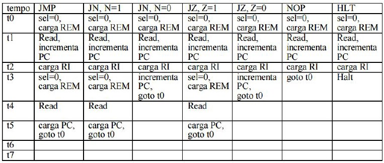

# Neander | VHDL Version
__Authors:__ Eduardo Stein Brito, Felipe Barbosa Tormes, Levindo Gabriel Taschetto Neto.

The Neander is a hipotetic processor made in the Federal University of Rio Grande do Sul.

This processor has the following characteristics: 

* Data width and 8-bit addresses
* Data represented in two's complement
* 8-bit accumulator (AC)
* 8-bit program pointer (PC)
* Status register with 2 condition codes: negative (N) and zero (Z)

And the following operations:

* NOP
* STA
* LDA
* ADD
* OR
* AND
* NOT
* JMP
* JN
* JZ
* HLT

In the figure below can be seen the finite state machine of Neander (portuguese version): 

